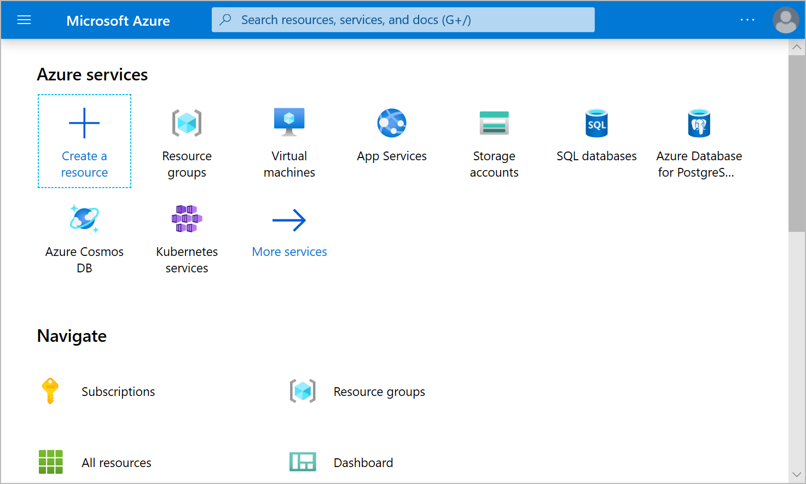
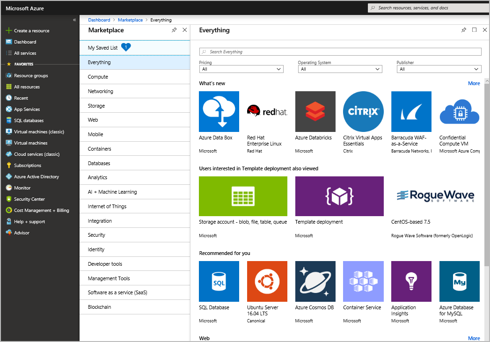

# Introduction to Fundamentals

## What is Cloud Computing?

**Cloud computing** is the delivery of computing services over the internet which is known as the *cloud.* 

The **services** are:

- *compute power* (how much processing your computer can do)
- *storage* (the volume of data you use on your computer)

You use the services provided on a computer which is somewhere in the cloud provider's datacenter. It is a way to rent computing power and storage from someone else's computer. 

## Why is cloud computing usually cheaper to use?

You only pay for the resources you use without worrying about managing the upkeep of the computer, so it is economically efficient or cost effective. Cloud computing allows for a flexible resources and cost effective scaling. Typically, cloud computing:

- Lowers operating costs
- Helps to run infrastructures efficiently
- Allows for efficient scaling

## What is Azure?

**Azure** is a set of cloud services provided by *Microsoft*. It supports infrastructure, platform, and software as the service computing. They are pay-as-you-go services.

### How does it work?

Azure uses **virtualization**. There is an abstraction layer called a *hypervisor* that separates the hardware and the operating system. The hypervisor emulates all the functions of a real computer in a virtual machine optimizing the capacity of the abstracted hardware. It can run many VMs with different OSs such as windows or linux. There are numerous datacenters in Microsoft, and each datacenter has many servers, and each server has a hypervisor that can have many different VMs on it. Each server runs a fabric controller on it. Each fabric controller is connected to the orchestrator that is responsible for managing everything that happens in azure including responding to user requests. User makes requests using the orchestrators Web API that can be called by many different tools. When a user makes a request to create a VM, orchestrator packages what's needed, sends request to the fabric controller which creates a VM. Once FC created a VM, the user can connect to it. 

### What is Azure Portal?

**Azure Portal** is a GUI web-based console that provides an alternative to command-line tools. It lets you create, configure, and control your Azure services and subscriptions. 

### What is Azure Marketplace?

**Azure Marketplace** is a tool using which customers can browse, try, and buy applications and services optimized to run on Azure from Microsoft partners, independent software vendors, and startups.

### What are Azure Services?

There are a lot of services available on Azure. Here are some most common categories of services:

- **Compute** - scale your computing capabilities on demand
- **Networking** - connect the cloud and on-premise infrastructure
- **Storage** - scale your data and up storage needs securely
- **Mobile** - build and deploy native apps
- **Databases** - bring databases to the cloud
- **Web** - build, deploy, manage, and scale web applications
- **IoT** - connect, monitor, and manage IoT assets as well as analyze the incoming data
- **Big Data** - run analytics on a massive scale
- **AI** - use existing data to forecast future behavior; build, train, and deploy ML models
- **DevOps** - create *build* and *release* pipelines to provide continuous integration, delivery and deployment

