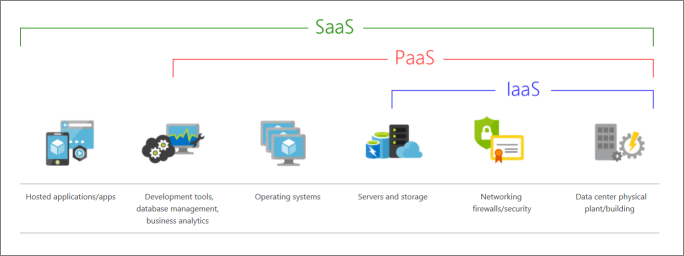
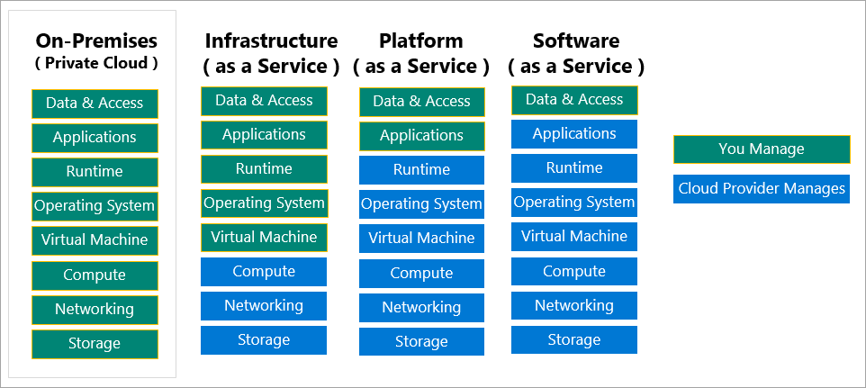

# Discuss Fundamental Concepts

## What are different types of cloud models?

There are three deployment models for cloud computing:

- public
- private
- hybrid

Each deployment model has different aspects.

- **Public Cloud** - services hosted by a third-party which are offered through public internet and available to anyone who can purchase them. 
- **Private Cloud** - services that are used exclusively by users from one organization; they are hosted at the organization's on-premises datacenters or by a third-party service provider
- **Hybrid Cloud** - environment that combines public and private cloud allowing the applications to be shared between them

### Comparison

**Public Cloud**

- No capital to scale up
- Apps can be quickly provisioned and deplrovisioned
- Pay for what you use

**Private Cloud**

- Hardware must be purchased
- Complete control over resources and secuirity
- Responsible for hardware maintenance and updates

**Hybrid Cloud**

- Most flexible
- Freedom to decide where to run the apps
- Control security, compliance and legal requirements

## Cloud Computing advantages

- **High Availability** - depending on the SLA (service-level agreement), get continuous user experience with no downtime
- **Scalability** - scale *vertically* (increase computing capacity by adding more RAM or CPUs to a VM) or *horizontally* (increase computing capacity by adding instances of resources, e.g., adding  more VMs)
- **Elasticity** - use of autoscaling feature
- **Agility** - quick deployment and configuration of cloud-based resources
- **Geo-distribution** - deploy to regional datacenters around the globe to ensure best performance based on the region
- **Disaster Recovery** - pray that your data is safe in the event of disaster because you're not responsible for it 😉 (not a con, that's a pro!!!)

## Capital expenses vs. operating expenses

- **Capital Expenditure (CapEx)** is spending money up-front on physical infrastructure, and then deducting that up-front expense over time. The up-front cost's value reduces over time. E.g., owning an infrastructure.
- **Operational Expenditure (OpEx)** is paying for services as you use them. There is no up-front cost. E.g., using cloud-based services.

CapEx requires significant up-front costs and ongoing maintenance and support while OpEx (consumption based model) requires paying only for the computing resources you use. 

### Cloud computing is a consumption-based model

Benefits:

- no upfront cost
- no need to buy and manage infrastructure
- ability to autoscale: pay for the additional resources when needed and stop paying for them when they are no longer needed

## Different Cloud Services

## What are could service model?

There are three different cloud service models: PaaS, IaaS, and SaaS. They define different levels of shared responsibility for cloud provider and cloud tenant. 

#### 1. *IaaS* == Infrastructure-as-a-Service
- Closest to managing physical servers
- Most flexible, gives complete control over the hardware but instead of buying it, you rent it
- Cloud provider responsibility:
    - hardware maintenance
- Cloud Tenant responsibility:
    - OS maintenance
    - network configuration
- *Advantages*:
    - **No CapEx** - no upfront cost
    - **Agility** - rapid deployment of new computing devices as setting up a VM is faster
    - **Management** - cloud provider manages and maintains cloud infrastructure and user manages and maintains the services
    - **Consumption based model** - operate under OpEx model, you pay only for what you use
    - **Skills** - no deep technical skills required to use
    - **Cloud benefits** - use the skills and expertise of the cloud provider to ensure the workloads are secure and available
    - **Flexibility** - user has control to configure and manage the hardware

#### 2. *PaaS* == Platform-as-a-Service
- Managed hosting environment
    - E.g., Azure App Services
- Cloud provider responsibility:
    - managing VMs and networking resources
- Cloud Tenant responsibility:
    - deploying apps
- *Advantages*:
    - **No CapEx** - no upfront cost
    - **Agility** - rapid deployment of new computing devices as setting up a VM is faster
    - **Consumption based model** - operate under OpEx model, you pay only for what you use
    - **Skills** - no deep technical skills required to use
    - **Cloud benefits** - use the skills and expertise of the cloud provider to ensure the workloads are secure and available
    - **Productivity** - cloud provider handles platform management and user can focus on app development only
- *Disadvantage*:
    - **Platform Limitations -** cloud platform may have some limitations that might affect how the application runs

#### 3. *SaaS* == Software-as-a-Service
- Centrally hosted and managed
    - E.g., Microsoft Office 365
- Cloud provider responsibility: 
    - managing everything (VMs, networking resources, data storage, apps)
- Cloud Tenant responsibility:
    - provide data
- *Advantages*:
    - **No CapEx** - no upfront cost
    - **Agility** - rapid deployment of new computing devices as setting up a VM is faster
    - **Consumption based model** - operate under OpEx model, you pay only for what you use
    - **Skills** - no deep technical skills required to use
    - **Flexibility** - user can access came app data from anywhere
- *Disadvantage*:
    - **Software limitations** - user is using as-is software and does not have a direct control of the features

| IaaS | PaaS | SaaS |
| :---: | :---: | :---: |
| The most flexible cloud service. | Focus on application development. | Pay-as-you-go pricing model. |
| You configure and manage the hardware for your application. |  Platform management is handled by the cloud provider. | Users pay for the software they use on a subscription model. |

### Comparison Chart

## Serverless Computing

Like PaaS, **serverless computing** allows faster application development since the user does not have to manage infrastructure as it is done by the cloud service provider. Serverless architectures are:

- *highly scalable*
- *event-driven* - use resources only when triggered to do so

Note: servers are still running the code. "Serverless" means that the infrastructure managing is invisible to the user. Thus, the developers can focus on the deliverable to provide the most value to the business, to better optimize the resources, and stay focused on innovation. 
