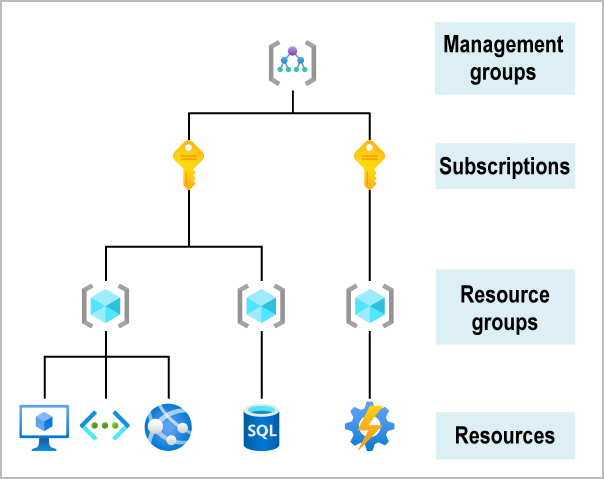
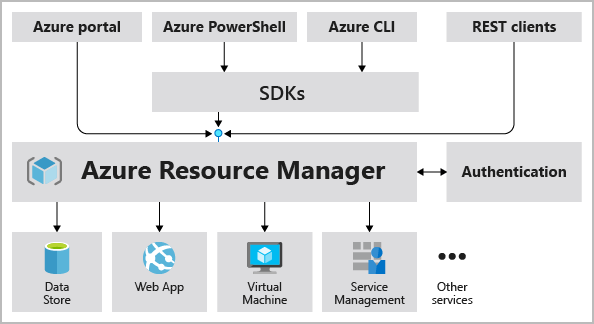
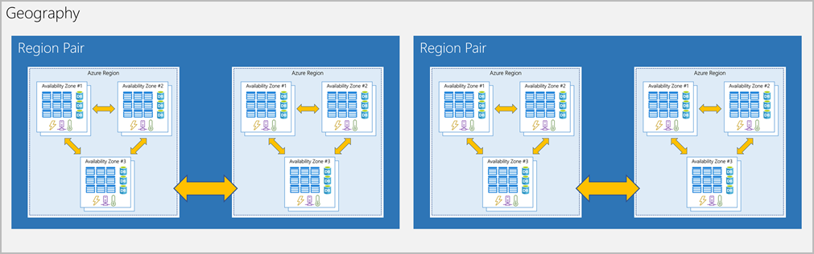

# Describe Core Azure Architectural Components

## Overview of Azure subscriptions, management groups, and resources

The organizing structure for resources in Azure has four levels: management groups, subscriptions, resource groups, and resources.

- **Resources** are the instances of services you create such as VMs, storage, databases, etc.
- **Resource groups** are the groups of resources (duh) which act as logical containers. They cannot be nested.

    It makes sense to group resources in a logical manner. Organizing resources by life cycle can be useful. Resource groups have role-based access control (RBAC) permissions. 

    Azure Resource Manager is the deployment and management service for Azure. When a user sends a request, Resource Manager receives it. It authenticates and authorizes the request and sends it to the Azure service, which takes the requested action. 

    

- **Subscriptions** group together user accounts and the resources that have been created by the user accounts. It allows you to provision resources. It is a *logical unit* of Azure. There are two types of boundaries that can be defined around Azure products, services, and resources with subscriptions:
    - **Billing boundary:** you can create multiple subscriptions for different types of billing requirements.
    - **Access control boundary:** applies access-management policies at the subscription level.
- **Management groups** help manage access, policy, and compliance for multiple subscriptions.

## Azure regions, availability zones, and region pairs

Resources are created in regions. **Region** is a geographical area that contains one or more datacenters and networked together with a low-latency network. Azure has more global regions than any other cloud provider. They give the user flexibility, better scalability, and redundancy.

**Availability zones** are physically separate datacenters within a region. It is set up to be an *isolation boundary.* Availability ones ensure redundancy to protect information in case of failure. They are connected through high-speed, private fiber-optic network. 

**Region Pairs** are created in the event if a large disaster affects two datacenters. Each Azure region is connected to another region within the same geography at least 300 miles away. This allows for replication of resources. 

